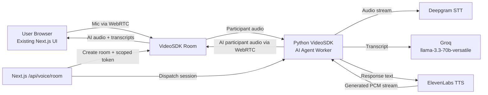

# VideoSDK Voice Migration

## 1. Full Migration Strategy

The realtime voice path is now VideoSDK-first. The browser no longer opens Deepgram sockets, records MediaRecorder chunks, or streams audio over custom WebSockets. The user joins a short-lived VideoSDK room, the AI worker joins the same room as an agent participant, and all bidirectional audio moves over VideoSDK WebRTC.

## 2. Backend Replacement Plan

The old Next.js realtime voice endpoints were removed:

- `src/app/api/voice/session/route.ts`
- `src/app/api/voice/respond/route.ts`
- `src/app/api/voice/transcribe/route.ts`
- `src/app/api/voice/tts/route.ts`

The replacement is:

- `src/app/api/voice/room/route.ts`: creates a VideoSDK room, mints a scoped token, records the app voice session, and dispatches the Python worker.
- `ai-worker/`: self-hosted Python VideoSDK AI Agent worker.

## 3. Files To Delete

Already removed from the realtime path:

- Old Deepgram browser token route
- Old browser audio transcription route
- Old SSE LLM/TTS response route
- Old direct TTS route
- Old Deepgram WebSocket hook implementation

## 4. Files To Retain

- `src/components/voice/VoiceAgentLayer.tsx`: modal UI, layout, animation, controls.
- `src/components/app/VoiceScreen.tsx`: dedicated voice page UI retained.
- `src/app/api/voice/booking/**`: mock booking/KYC flow.
- `src/app/api/voice/diagnostics/route.ts`: sanitized client diagnostics.
- Chat, predictive prefetch, and FD advisor UI components.

## 5. Files To Refactor

- `src/components/voice/VoiceAgentLayer.tsx`: now uses `VideoSdkVoiceSessionController`.
- `src/components/voice/VideoSdkVoiceSessionController.tsx`: owns VideoSDK room join/leave, mic track, agent audio, agent transcripts, and interruption commands.
- `src/hooks/useDuplexVoiceSession.ts`: now only contains shared VideoSDK voice types/helpers.
- `src/lib/server/videosdk.ts`: central VideoSDK token, room, and worker dispatch service.
- `src/env.ts` and `.env.example`: VideoSDK and worker environment configuration.

## 6. Updated Architecture Diagram

## 7. VideoSDK Integration Steps

1. Install `@videosdk.live/react-sdk`.
2. Create `/api/voice/room` to create rooms through VideoSDK REST.
3. Mint short-lived participant tokens from the backend.
4. Mount `MeetingProvider` inside the existing voice modal.
5. Join with `micEnabled: true`, `webcamEnabled: false`, and a VideoSDK microphone track.
6. Render the AI participant audio with `AudioPlayer`.
7. Observe `useAgentParticipant` for agent state and transcripts.

## 8. Backend Worker Architecture

The worker is a FastAPI service that starts one async session per `roomId`. Each session creates:

- `JobContext(RoomOptions(room_id=...))`
- `AgentSession`
- `Pipeline(stt=DeepgramSTT, llm=OpenAILLM configured for Groq, tts=ElevenLabsTTS, vad=SileroVAD, turn_detector=TurnDetector)`
- Async event queue for room PubSub telemetry
- Graceful close on idle timeout, DELETE `/sessions/{roomId}`, or process shutdown

## 9. Frontend Integration Changes Only

The modal UI remains visually intact. The logic underneath changed from browser socket orchestration to:

- Room bootstrap fetch
- VideoSDK meeting lifecycle
- VideoSDK microphone track
- VideoSDK agent state/transcript callbacks
- VideoSDK PubSub/DataChannel interruption command

## 10. Deepgram Integration

Deepgram is only used from the Python worker through the VideoSDK plugin. Browser Deepgram token grants and browser WebSocket streaming are removed.

## 11. Groq Integration

Groq uses VideoSDK's OpenAI-compatible LLM adapter:

- `base_url=https://api.groq.com/openai/v1`
- `model=llama-3.3-70b-versatile`
- `GROQ_API_KEY` supplied as the OpenAI-compatible API key

## 12. ElevenLabs Integration

ElevenLabs TTS runs in the worker with streaming enabled and publishes generated agent audio back into the room through VideoSDK.

## 13. Realtime Room Lifecycle

1. User opens voice modal.
2. Next.js creates a VideoSDK room and token.
3. Next.js dispatches the worker.
4. Browser joins as customer participant.
5. Worker joins as AI participant.
6. User leaves or closes modal.
7. Browser leaves; worker receives stop/idle cleanup; room auto-closes and deactivates.

## 14. State Management Flow

VideoSDK agent states map into the existing UI states:

- `LISTENING` -> `listening`
- `THINKING` -> `processing`
- `SPEAKING` -> `speaking`
- `IDLE` -> `listening`
- SDK errors -> `error`

## 15. Deployment Strategy

- Deploy Next.js as usual.
- Deploy `ai-worker` as a long-lived Python service.
- Set `VOICE_AGENT_WORKER_URL` in Next.js to the worker base URL.
- Use the same `VOICE_AGENT_WORKER_SECRET` in both services.
- Scale the worker horizontally behind a load balancer; sessions are idempotent by `roomId`.

## 16. Security Best Practices

- Generate VideoSDK tokens only on the backend.
- Prefer short-lived room-scoped tokens.
- Keep VideoSDK, Deepgram, Groq, and ElevenLabs keys server-side only.
- Protect worker dispatch with `VOICE_AGENT_WORKER_SECRET`.
- Keep diagnostics sanitized; never log raw access tokens.
- Use VideoSDK webhooks for participant/session auditing.

## 17. Environment Variables

Next.js:

- `VIDEOSDK_API_KEY`
- `VIDEOSDK_SECRET_KEY`
- `VIDEOSDK_AUTH_TOKEN` optional fallback
- `VIDEOSDK_ROOM_WEBHOOK_URL` optional
- `VOICE_AGENT_WORKER_URL`
- `VOICE_AGENT_WORKER_SECRET`

Worker:

- `VIDEOSDK_API_KEY`
- `VIDEOSDK_SECRET_KEY`
- `VIDEOSDK_AUTH_TOKEN` optional
- `DEEPGRAM_API_KEY`
- `GROQ_API_KEY`
- `GROQ_MODEL`
- `GROQ_BASE_URL`
- `ELEVENLABS_API_KEY`
- `ELEVENLABS_VOICE_ID`
- `ELEVENLABS_MODEL`
- `VOICE_AGENT_WORKER_SECRET`

## 18. Production Scaling Strategy

- Keep one worker task per room.
- Use multiple worker replicas for horizontal capacity.
- Put the worker behind an internal HTTPS load balancer.
- Use room/session webhooks for cleanup reconciliation.
- Add queue-backed dispatch later if traffic exceeds one HTTP dispatch per voice start.

## 19. Refactored Production-Ready Code

Primary implementation files:

- `src/app/api/voice/room/route.ts`
- `src/lib/server/videosdk.ts`
- `src/components/voice/VideoSdkVoiceSessionController.tsx`
- `src/components/voice/VoiceAgentLayer.tsx`
- `ai-worker/nivesh_voice_agent/*`

## 20. Cleanup Plan For Old WebSocket Architecture

Completed:

- Removed browser Deepgram WebSocket logic.
- Removed MediaRecorder chunk transport from the continuous voice agent.
- Removed browser Deepgram token grants.
- Removed old SSE response/TTS backend.
- Removed reconnect heuristics for close code `1006`.

Remaining operational cleanup:

- Remove stale env values from deployed environments after rollout.
- Monitor VideoSDK room/session webhooks for orphan sessions.
- Add worker metrics export if using Prometheus/OpenTelemetry.
