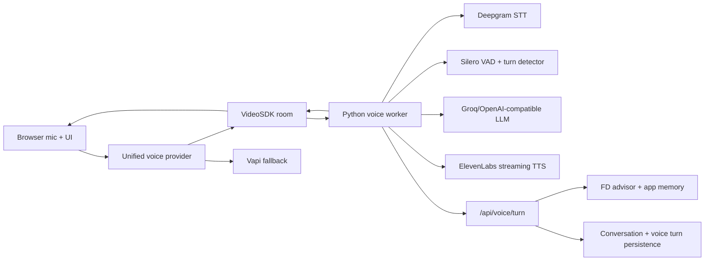

# Realtime Voice Agent Architecture

## Architecture

Nivesh Saathi uses a VideoSDK-first realtime voice path with Vapi as rollout fallback.



The frontend calls `/api/voice/provider` before starting a call. `auto` prefers VideoSDK only when the app has VideoSDK config, a worker URL, and a healthy worker. If that check fails, it falls back to Vapi when configured.

## Audio Pipeline

1. Browser captures mic with echo cancellation, noise suppression, and auto gain through VideoSDK.
2. Audio enters the worker room participant.
3. Deepgram produces interim and final STT.
4. Silero VAD and turn detection identify speech boundaries.
5. The worker publishes typed room events for UI state.
6. The LLM generates a concise spoken reply.
7. ElevenLabs streams PCM audio back into the room.
8. The worker reports the completed turn to `/api/voice/turn` for app memory, analytics, and UI context.

## STT Workflow

- English, Hindi, and Hinglish use `VOICE_AGENT_STT_PRIMARY=flux-general-multi`.
- Tamil, Telugu, Marathi, and Bhojpuri/Hindi fallback use `VOICE_AGENT_STT_FALLBACK=nova-3`.
- Browser-side partial text is stabilized with hysteresis so short flickers do not replace longer partials.
- Repeated adjacent words are removed before final dispatch.
- Duplicate final transcripts are rejected.
- Backchannels such as `okay`, `hmm`, and `right` are not treated as full turns.

## TTS Workflow

- The worker uses ElevenLabs streaming TTS with `eleven_flash_v2_5`.
- Assistant text deltas are published as `assistant_delta`.
- `assistant_speech_start` updates UI state before audio playback.
- User interruption publishes `assistant_interrupted`; frontend controls also send a room control event.

## Turn Detection

Endpointing defaults:

- `650ms` after clear punctuation.
- `1200ms` without punctuation.
- `1800ms` after filler or incomplete clauses.
- `8000ms` max silence timeout.

The same semantic rules exist in TypeScript and Python. The frontend uses them for browser fallback transcription and transcript display. The worker uses them for endpoint diagnostics and room events.

## Conversation Lifecycle

1. User opens voice.
2. Frontend fetches `/api/voice/provider`.
3. Frontend creates `/api/voice/room`.
4. Next.js creates a VideoSDK room, starts a voice session record, and dispatches the worker.
5. Worker joins the room and emits `session_started`.
6. User speaks; worker emits `user_speech_start`, `endpoint_candidate`, and `user_transcript_final`.
7. Assistant speaks; worker emits `assistant_speech_start` and `assistant_delta`.
8. Worker reports the turn to `/api/voice/turn`.
9. App persists user/assistant messages, voice turn latency, and analytics.
10. Session closes or reconnects as needed.

## Frontend And Event Flow

Typed events:

- `session_started`
- `user_speech_start`
- `user_transcript_partial`
- `endpoint_candidate`
- `user_transcript_final`
- `assistant_delta`
- `assistant_speech_start`
- `assistant_interrupted`
- `session_reconnecting`
- `session_failed`

Legacy worker event names are still normalized on the frontend, so existing deployments degrade safely during rollout.

## State Management

- `UnifiedVoiceSessionController` chooses VideoSDK or Vapi.
- `VideoSdkVoiceSessionController` handles room creation, mic track creation, transcript stabilization, fallback trigger, and room events.
- `VapiVoiceSessionController` remains as a fallback and now uses the same transcript stabilizer.
- `/voice` opens the same unified live voice layer while retaining its existing visual FD journey UI.
- Conversation memory persists through existing chat and voice session repositories.

## Performance Optimization Report

- Worker health check avoids starting a dead VideoSDK session.
- Browser mic uses echo cancellation, noise suppression, and auto gain.
- STT endpointing was changed from aggressive `320ms` to semantic defaults.
- Vapi fallback prevents total voice outage when the self-hosted worker is down.
- Client diagnostics record mic start, room creation, provider fallback, and session failures.
- App voice turns store latency metadata for later analysis.

Target perceived delay remains below `800ms` after a true endpoint. The agent intentionally waits longer during thinking pauses to avoid mid-sentence cutoffs.

## Bug Fix Summary

- Removed Vapi hardcoding from the main voice overlay.
- Added VideoSDK-first provider selection.
- Fixed unstable partial transcript display.
- Prevented duplicate final transcripts.
- Added patient endpointing for fillers and incomplete phrases.
- Fixed silent VideoSDK room success when the worker was not dispatched.
- Removed duplicate empty local Deepgram/ElevenLabs overrides from `.env.local`.

## Production Settings

```env
NEXT_PUBLIC_VOICE_PROVIDER=auto
VOICE_AGENT_WORKER_URL=https://your-worker.example.com
VOICE_AGENT_WORKER_SECRET=replace-with-shared-secret
VOICE_AGENT_STT_PRIMARY=flux-general-multi
VOICE_AGENT_STT_FALLBACK=nova-3
VOICE_AGENT_EOT_THRESHOLD=0.78
VOICE_AGENT_EAGER_EOT_THRESHOLD=0.55
VOICE_AGENT_EOT_TIMEOUT_MS=8000
VOICE_AGENT_SEMANTIC_NO_PUNCTUATION_MS=1200
VOICE_AGENT_SEMANTIC_FILLER_MS=1800
```

Worker-only:

```env
VOICE_AGENT_APP_URL=https://your-app.example.com
DEEPGRAM_API_KEY=
GROQ_API_KEY=
ELEVENLABS_API_KEY=
VIDEOSDK_API_KEY=
VIDEOSDK_SECRET_KEY=
```

## Setup

1. Configure app env in Vercel or `.env.local`.
2. Configure worker env in `ai-worker/.env`.
3. Start the app: `npm run dev`.
4. Start the worker: `python -m nivesh_voice_agent serve --host 0.0.0.0 --port 8080`.
5. Visit `/api/voice/provider` while signed in to confirm VideoSDK availability.
6. Start voice from chat or `/voice`.

## Troubleshooting

- `worker_unhealthy`: worker is not reachable at `/health`.
- `worker_not_configured`: set `VOICE_AGENT_WORKER_URL`.
- `videosdk_not_configured`: set VideoSDK API key/secret or auth token.
- Vapi starts instead of VideoSDK: check worker health and `NEXT_PUBLIC_VOICE_PROVIDER`.
- No TTS: verify `ELEVENLABS_API_KEY` and worker logs.
- No transcript: verify `DEEPGRAM_API_KEY`, STT model, browser mic permission, and VideoSDK room join.
- Robotic cutoff: increase `VOICE_AGENT_SEMANTIC_NO_PUNCTUATION_MS` or `VOICE_AGENT_SEMANTIC_FILLER_MS`.

## Scaling

- Run the Python worker as a non-sleeping service.
- Scale workers horizontally behind a load balancer.
- Keep worker instances near the primary user region.
- Monitor room creation, worker dispatch failure, STT latency, LLM first token, TTS first audio, interruptions, reconnects, and total turn latency.
- Use Vapi fallback during rollout and disable it only after VideoSDK worker SLOs are stable.

## Future Improvements

- Add worker-level synthetic audio regression tests.
- Persist full endpoint decision history in voice sessions.
- Add provider-specific audio packet loss telemetry.
- Add phrase hints for FD bank names once Deepgram plugin exposes a stable option.
- Promote `/api/voice/turn` to stream assistant deltas directly into the worker once the VideoSDK LLM plugin API is stabilized.
